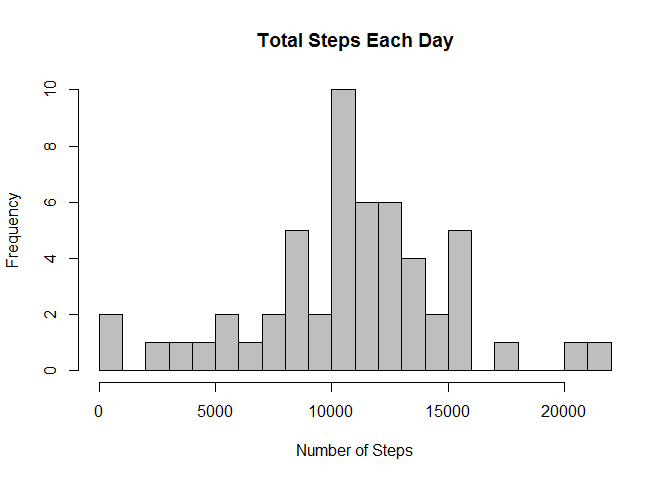
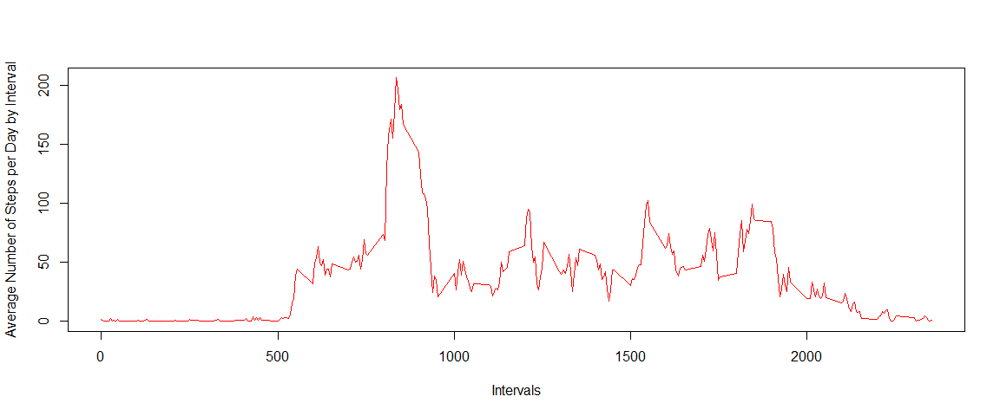
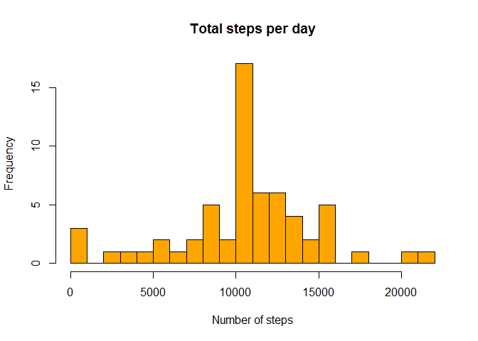
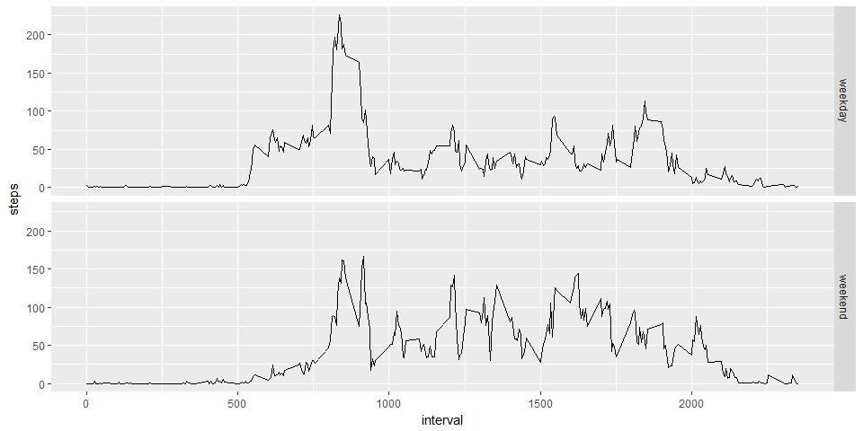

# Reproducible Research: Peer Assessment 1
Rod Paris  
February 10, 2017  

## Loading and preprocessing the data

Download, unzip and load data into data frame `activity`. 


```r
if(!file.exists("getdata-projectfiles-UCI HAR Dataset.zip")) {
        temp <- tempfile()
        download.file("http://d396qusza40orc.cloudfront.net/repdata%2Fdata%2Factivity.zip",temp)
        unzip(temp)
        unlink(temp)
}
```

Reading the data into activity data frame and show some summary statistics

```r
activity <- read.csv("activity.csv")
str(activity)
```

```
## 'data.frame':	17568 obs. of  3 variables:
##  $ steps   : int  NA NA NA NA NA NA NA NA NA NA ...
##  $ date    : Factor w/ 61 levels "2012-10-01","2012-10-02",..: 1 1 1 1 1 1 1 1 1 1 ...
##  $ interval: int  0 5 10 15 20 25 30 35 40 45 ...
```

```r
summary(activity)
```

```
##      steps                date          interval     
##  Min.   :  0.00   2012-10-01:  288   Min.   :   0.0  
##  1st Qu.:  0.00   2012-10-02:  288   1st Qu.: 588.8  
##  Median :  0.00   2012-10-03:  288   Median :1177.5  
##  Mean   : 37.38   2012-10-04:  288   Mean   :1177.5  
##  3rd Qu.: 12.00   2012-10-05:  288   3rd Qu.:1766.2  
##  Max.   :806.00   2012-10-06:  288   Max.   :2355.0  
##  NA's   :2304     (Other)   :15840
```


Convert date to POSIXct class using lubridate package and convert interval to hour:minute format

```r
library(lubridate)
```

```
## Warning: package 'lubridate' was built under R version 3.3.2
```

```r
activity$date <- ymd(activity$date)
str(activity)
```

```
## 'data.frame':	17568 obs. of  3 variables:
##  $ steps   : int  NA NA NA NA NA NA NA NA NA NA ...
##  $ date    : Date, format: "2012-10-01" "2012-10-01" ...
##  $ interval: int  0 5 10 15 20 25 30 35 40 45 ...
```


## What is mean total number of steps taken per day?


#### 1. Calculate the total number of steps taken per day (ignore the missing values)


```r
steps_by_day <- aggregate(steps ~ date, activity, sum)
```


####  2. Make a histogram of the total number of steps taken each day


```r
hist(steps_by_day$steps, main="Total Steps Each Day",
col="grey", xlab="Number of Steps", breaks=20)
```

<!-- -->

#### 3. Calculate and report the mean and median of the total number of steps taken per day


```r
mean_steps <- mean(steps_by_day$steps)
median_steps <- median(steps_by_day$steps)
```

Mean and median of the total number of steps taken per day are 1.076619\times 10^{4} steps and 10765 steps, respectively.


## What is the average daily activity pattern?


#### 1. Make a time series plot (i.e. type = "l") of the 5-minute interval (x-axis) and the average number of steps taken, averaged across all days (y-axis)  


```r
steps_by_interval <- aggregate(steps ~ interval, activity, mean)
plot(x = steps_by_interval$interval,y = steps_by_interval$steps,type = "l",
     col = "red", xlab="Intervals", 
     ylab = "Average Number of Steps per Day by Interval")
```

<!-- -->


#### 2. Which 5-minute interval, on average across all the days in the dataset, contains the maximum number of steps?


```r
max_interval <- steps_by_interval[which.max(steps_by_interval$steps),1]
```

Interval **"835"** contains on average the maximum number of steps.


## Imputing missing values


There are a number of days/intervals where there are missing values (coded as NA). The presence of missing days may introduce bias into some calculations or summaries of the data.
* Create a new dataset that is equal to the original dataset but with the missing data filled in.
* Make a new histogram.
Missing values were imputed by inserting the average for each interval for all days.


#### 1. Calculate and report the total number of missing values in the dataset (i.e. the total number of rows with NAs)


```r
incomplete <- sum(!complete.cases(activity))
percentage_na <- mean(is.na(activity$steps))
```

Total number of missing values in the dataset amounts to **2304 ** (what is **13.1** % of total observations).


#### 2. Devise a strategy for filling in all of the missing values in the dataset


There are a number of days/intervals where there are missing values (coded as NA). The presence of missing days may introduce bias into some calculations or summaries of the data.
Here, missing values were imputed by inserting the average for each interval for all days.


#### 3. Create a new dataset that is equal to the original dataset but with the missing data filled in.


```r
imputed_activity <- transform(activity, 
                          steps = ifelse(is.na(activity$steps),
                                         steps_by_interval$steps[match(activity$interval,
                                                                       steps_by_interval$interval)], 
                                         activity$steps))
```

Zeroes were imputed for 10-01-2012 because it was the first day and would have been over 9,000 steps higher than the following day, which had only 126 steps. NAs then were assumed to be zeros to fit the rising trend of the data. 


```r
imputed_activity[as.character(imputed_activity$date) == "2012-10-01", 1] <- 0
```


#### 4. Make a histogram of the total number of steps taken each day and Calculate and report the mean and median total number of steps taken per day


```r
steps_by_day_imputed <- aggregate(steps ~ date, imputed_activity, sum)
summary(steps_by_day_imputed$steps)
```

```
##    Min. 1st Qu.  Median    Mean 3rd Qu.    Max. 
##       0    8918   10770   10590   12810   21190
```

```r
hist(steps_by_day_imputed$steps,col="orange",breaks=20,main="Total steps per day",xlab="Number of steps")
```

<!-- -->

* Calculate new mean and median for imputed data


```r
mean_steps_imputed <- mean(steps_by_day_imputed$steps)
median_steps_imputed <- median(steps_by_day_imputed$steps)
```

* Calculate difference between imputed and non-imputed data.


```r
mean_diff <- mean_steps_imputed - mean_steps
median_diff <- median_steps_imputed - median_steps

total_diff <- sum(steps_by_day_imputed$steps) - sum(steps_by_day$steps)
```

* The imputed data mean is 1.058969\times 10^{4}.
* The imputed data median is 1.076619\times 10^{4}.
* The difference between the non-imputed mean and imputed mean is -176.49.
* The difference between the non-imputed mean and imputed mean is 1.19.
* There are 7.536332\times 10^{4} more steps in the imputed data.

Imputing missing values, mean of the total number of steps taken per day  increased while median decreased, compared to estimates from the first part (ingoring missing values). Imputing missing data resulted in increasing of total steps.


## Are there differences in activity patterns between weekdays and weekends?


#### 1. Create a new factor variable in the dataset with two levels - "weekday" and "weekend" indicating whether a given date is a weekday or weekend day


```r
library(dplyr,quietly = TRUE)
```

```
## Warning: package 'dplyr' was built under R version 3.3.2
```

```r
is_weekday <-function(date){
        if(wday(date)%in%c(1,7)) result<-"weekend"
        else
                result<-"weekday"
        result
}


imputed_activity <- mutate(imputed_activity,date=ymd(date)) %>%
        mutate(day=sapply(date,is_weekday))
table(imputed_activity$day)
```

```
## 
## weekday weekend 
##   12960    4608
```


#### 2. Make a panel plot containing a time series plot (i.e. type = "l") of the 5-minute interval (x-axis) and the average number of steps taken, averaged across all weekday days or weekend days (y-axis)


```r
steps_by_interval_imputed <- aggregate(steps ~ interval + day, imputed_activity, mean)

library(ggplot2)
qplot(interval,steps,data=steps_by_interval_imputed,geom="line",facets=day~.)
```

<!-- -->

There is a higher peak earlier on weekdays, and more overall activity on weekends.  
